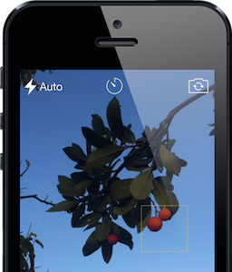
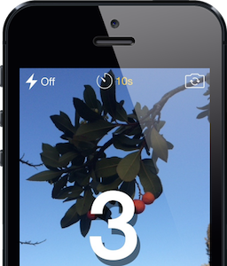

# UIView+CameraBackground
Show camera layer as a background to any UIView.

## Features
* Both **front and back** camera supported.
* **Flash** modes: auto, on, off.
* Countdown **timer**.
* Tap to **focus**.
* Pinch to **zoom**.

<p align="center">
 &nbsp; 
</p>

## Usage

```swift
view.addCameraBackground()
// ...
view.takeCameraSnapshot( {
      // animate snapshot capture
      self.view.alpha = 0
      UIView.animateWithDuration(1) { self.view.alpha = 1 }
  },
  completion: { (capturedImage, error) -> () in
      self.view.freeCameraSnapshot() // unfreeze image
      // ... handle capturedImage and error
  }
)
// ...
view.removeCameraBackground()
```

Remeber to add `NSCameraUsageDescription` to your `Info.plist`.